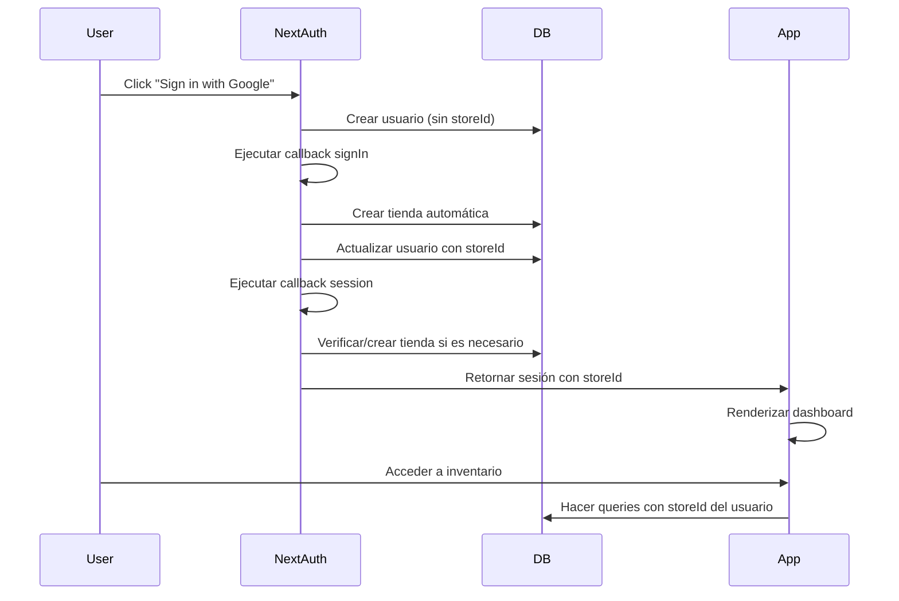

# Guía de Prueba de Autenticación

## Problema Original ❌
Cuando un usuario iniciaba sesión con Google o Discord, se creaba en la base de datos pero **no se le asignaba una tienda**, lo que causaba el error:
```
❌ tRPC failed on inventory.getBatches: User not associated with a store
```

## Solución Implementada ✅

Se ha implementado una lógica automática de asignación de tienda que funciona en dos niveles:

### 1. **Callback `signIn`** 
- Se ejecuta cuando el usuario se autentica
- Si el usuario no tiene `storeId`, crea una tienda automáticamente con el nombre: `"{nombre_usuario}'s Store"`
- Actualiza el usuario en la BD con el `storeId`

### 2. **Callback `session` (Mejorado)**
- Se ejecuta cuando se crea la sesión de usuario
- Realiza una verificación adicional para asegurar que el usuario tiene `storeId`
- Si por algún motivo el usuario no tiene tienda, la crea automáticamente
- Garantiza que la sesión siempre incluya `storeId`

## Pruebas Manuales

### Opción 1: Con Usuarios de Prueba (Sin OAuth)
```bash
# Ejecutar el seed de datos
npm run db:seed
```

**Usuarios creados:**
- **Gerente (Tienda 1)**: `gerente@tienda1.com` | Password: `Password123!`
- **Empleado (Tienda 1)**: `empleado@tienda1.com` | Password: `Password123!`
- **Gerente (Tienda 2)**: `gerente@tienda2.com` | Password: `Password123!`

Estos usuarios ya tienen tiendas asignadas correctamente.

### Opción 2: Con OAuth (Google/Discord)
1. Ir a la página de login: `http://localhost:3000/auth/login`
2. Hacer clic en "Sign in with Google" o "Sign in with Discord"
3. Autenticarse con tu cuenta
4. Verificar que:
   - ✅ No hay error "User not associated with a store"
   - ✅ Se puede acceder al dashboard
   - ✅ Se muestra información de batches
   - ✅ Se puede consultar el inventario

## Verificación en la BD

Para verificar que la tienda se creó correctamente:

```sql
-- Ver usuarios con sus tiendas
SELECT u.id, u.email, u.name, u."storeId", s.name as store_name 
FROM "User" u
LEFT JOIN "Store" s ON u."storeId" = s.id
ORDER BY u."createdAt" DESC;

-- Ver tiendas creadas
SELECT id, name, location, "createdAt" 
FROM "Store" 
ORDER BY "createdAt" DESC;
```

## Logs de Debugging

Los siguiente logs pueden ayudarte a diagnosticar problemas:

```
[AUTH_JWT]           - Token JWT creado/actualizado
[AUTH_SIGNIN]        - Validación de login y creación de tienda
[AUTH_SESSION]       - Actualización de sesión
[AUTH_SIGNIN_ERROR]  - Error al crear tienda en signIn
[AUTH_SESSION_ERROR] - Error al asegurar tienda en session callback
```

### Debug Endpoint

Para ver el estado actual de la sesión y los datos del token JWT:

```bash
# URL: http://localhost:3000/api/debug/session
# Muestra:
# - Session actual (del JWT token)
# - Usuario en BD
# - Número de sesiones en BD (siempre vacío con JWT)
```

### JWT Strategy

Esta autenticación usa **NextAuth.js con JWT strategy**:

- ✅ No hay queries a BD por cada request (mejor performance)
- ✅ Token firmado y almacenado en cookie httpOnly
- ✅ Datos de usuario (id, role, storeId) viajan en el token
- ✅ Auto-renovación cada hora

**Duración de sesión**: 30 días

## Flujo Completo de Autenticación



## Datos de Prueba Creados por Seed

El script `prisma/seed.ts` crea:

- **2 Tiendas**
  - Tienda Principal
  - Tienda Secundaria

- **5 Categorías**
  - Bebidas
  - Snacks
  - Lácteos
  - Frutas y Verduras
  - Congelados

- **7 Productos** (distribuidos entre tiendas)

- **3 Usuarios** (con tiendas asignadas)

- **19 Lotes (Batches)**
  - Activos (15)
  - Expirados (1)
  - Próximos a expirar (3)

- **3 Alertas**
  - Stock bajo
  - Próximamente a expirar
  - Expirado

## Troubleshooting

### ❌ Error: "User not associated with a store"
**Causa**: El callback de autenticación no se ejecutó correctamente
**Solución**: 
1. Verificar logs en la consola
2. Ejecutar `npm run db:seed` nuevamente
3. Limpiar cookies/sessiones y probar de nuevo

### ❌ Error: "Can't reach database"
**Causa**: Base de datos no está disponible
**Solución**: 
1. Verificar que `.env` tiene la URL de BD correcta
2. Verificar conexión a internet (para Neon)
3. Verificar credenciales en `.env.local`

### ❌ Error: "PrismaClient not initialized"
**Causa**: Cliente Prisma no se generó
**Solución**: 
```bash
npx prisma generate
npm run db:seed
```

## Preguntas Frecuentes

**P: ¿Qué sucede si un usuario intenta cambiar de tienda?**
A: Actualmente, cada usuario está vinculado a UNA tienda. Para cambiar tiendas, se necesitaría que un admin actualice el `storeId` manualmente en la BD.

**P: ¿Puedo crear múltiples tiendas para un usuario?**
A: No, con el modelo actual. Cada usuario tiene UN `storeId`. Para implementar múltiples tiendas por usuario, se necesitaría create una tabla de relación `UserStore`.

**P: ¿El callback signIn afecta el performance?**
A: Marginalmente. Se ejecuta una vez por login. Usa operaciones de BD que son rápidas (create, update).
